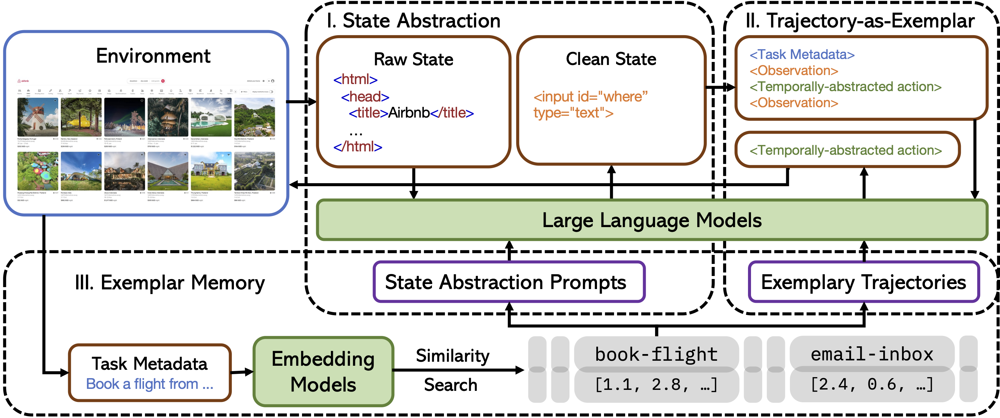

# Overview
Working to improve Synapse's `CompWoB` performance as a theme for the World Model Course.

# How To Use
The results in csv format are output to `results/compwob` when `run_compwob.py` is executed.
```shell
# build memory
make memory
 # or 
python build_memory.py --env miniwob

# run compwob
run_compwob
 # or
python run_compwob.py
```
<br>

The original Synapse readme is below.

<hr>

<p align="center">
  <a href="https://ltzheng.github.io/Synapse/">
    
  </a>
</p>

---

Code for our ICLR 2024 paper [Synapse: Trajectory-as-Exemplar Prompting with Memory for Computer Control](https://openreview.net/forum?id=Pc8AU1aF5e)

[](https://www.python.org/downloads/release/python-31012/)
<a href="https://github.com/psf/black"></a>


The agent trajectories and latest updates can be found at our [website](https://ltzheng.github.io/Synapse/).

## Overview

We introduce Synapse, an agent that incorporates trajectory-as-exemplar prompting with the associated memory for solving computer control tasks.




## Install

```bash
conda create -n synapse python=3.10 -y
conda activate synapse
pip install -r requirements.txt
```

Install [Faiss](https://github.com/facebookresearch/faiss/blob/main/INSTALL.md) and Download [Mind2Web](https://github.com/OSU-NLP-Group/Mind2Web) dataset and element rankings. The directory structure should look like this:
```
Mind2Web
├── data
|   |── scores_all_data.pkl
│   ├── train
│   │   └── train_*.json
│   ├── test_task
│   │   └── test_task_*.json
│   ├── test_website
│   │   └── test_website_*.json
│   └── test_domain
│       └── test_domain_*.json
└── ...
```

## Run
Use `build_memory.py` to setup the exemplar memory.
```bash
python build_memory.py --env miniwob
python build_memory.py --env mind2web --mind2web_data_dir path/to/Mind2Web/data
```
The `memory` folder should contain the following two files:
`index.faiss` and `index.pkl`.

Run MiniWoB++ experiments:
```bash
python run_miniwob.py --env_name <subdomain> --seed 0 --num_episodes 50
python run_miniwob.py --env_name <subdomain> --no_memory --no_filter --seed 0 --num_episodes 50
```

Run Mind2Web experiments:
```bash
python run_mind2web.py --data_dir path/to/Mind2Web/data --benchmark {test_task/test_website/test_domain} --no_memory --no_trajectory
python run_mind2web.py --data_dir path/to/Mind2Web/data --benchmark {test_task/test_website/test_domain} --no_memory
python run_mind2web.py --data_dir path/to/Mind2Web/data --benchmark {test_task/test_website/test_domain}
```

## Results

Synapse outperforms the state-of-the-art methods on both MiniWoB++ and Mind2Web benchmarks.


<div style="display: flex; justify-content: space-between;">
    
    
</div>

<div style="display: flex; justify-content: space-between;">
    
    
</div>


The trajectories of all experiments can be downloaded from [here](https://drive.google.com/file/d/1CnM3GF4kTAMZkGFasSXZ4Z2n5eiV8M9Z/view?usp=sharing).


## Fine-tuning

Synapse also improves fine-tuning performance on Mind2Web.

Configure python environment:
```bash
pip install -r requirements.txt
pip install git+https://github.com/huggingface/peft.git@e536616888d51b453ed354a6f1e243fecb02ea08
pip install git+https://github.com/huggingface/transformers.git@c030fc891395d11249046e36b9e0219685b33399
```

Build Mind2Web datasets for Synapse and memory:
```bash
python build_dataset.py --data_dir path/to/Mind2Web/data --no_trajectory --top_k_elements 20 --benchmark train
python build_dataset.py --data_dir path/to/Mind2Web/data --top_k_elements 20 --benchmark train
python build_memory.py --env mind2web --mind2web_data_dir path/to/Mind2Web/data --mind2web_top_k_elements 3
```

Fine-tune:
```bash
python finetune_mind2web.py --data_dir path/to/Mind2Web/data --base_model codellama/CodeLlama-7b-Instruct-hf --cache_dir <MODEL_PATH> --lora_dir <CHECKPOINT_PATH> --no_trajectory --top_k_elements 20
python finetune_mind2web.py --data_dir path/to/Mind2Web/data --base_model codellama/CodeLlama-7b-Instruct-hf --cache_dir <MODEL_PATH> --lora_dir <CHECKPOINT_PATH> --top_k_elements 20
```

Evaluate:
```bash
python evaluate_mind2web.py --data_dir path/to/Mind2Web/data --no_memory --no_trajectory --benchmark test_domain --base_model codellama/CodeLlama-7b-Instruct-hf --cache_dir <MODEL_PATH> --lora_dir <CHECKPOINT_PATH> --top_k_elements 20
python evaluate_mind2web.py --data_dir path/to/Mind2Web/data --no_memory --benchmark test_domain --base_model codellama/CodeLlama-7b-Instruct-hf --cache_dir <MODEL_PATH> --lora_dir <CHECKPOINT_PATH> --top_k_elements 20
```

## Citation

If you find our work helpful, please use the following citation:
```bibtex
@inproceedings{zheng2023synapse,
  title={Synapse: Trajectory-as-Exemplar Prompting with Memory for Computer Control},
  author={Zheng, Longtao and Wang, Rundong and Wang, Xinrun and An, Bo},
  booktitle={The Twelfth International Conference on Learning Representations},
  year={2023}
}
```
